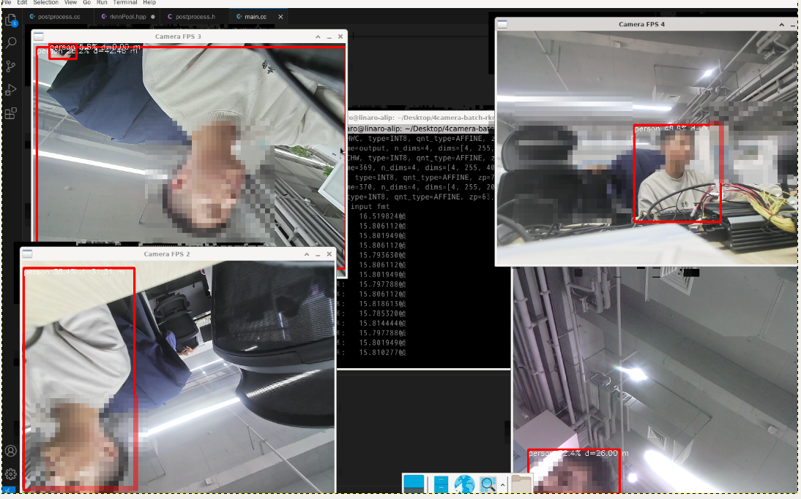

# 简介
* 此仓库为c++实现yolo5的batch多线程推理, 大体改自https://github.com/leafqycc/rknn-cpp-Multithreading
* 实现4路摄像头的batch=4的推理

# 更新说明

# 使用说明
### 模型转换
  * yolov5工程下export.py转换onnx，直接转，切忌修改batch_size
  * 参考网上方法，rknn-toolkit2进行onnx转rknn，需要修改./rknn-toolkit2/examples/onnx/test.py为本工程test.py

### 演示
  * 系统需安装有**OpenCV**，如果需要读取AHD摄像头还需要安装**gstreamer**
  * 运行build-linux_RK3588.sh
  * 可切换至root用户运行performance.sh定频提高性能和稳定性
  * 编译完成后进入install运行命令./rknn_yolov5_demo **模型所在路径**

### 部署应用
  * 修改include/rknnPool.hpp中的rknn_lite类
  * 修改inclue/rknnPool.hpp中的rknnPool类的构造函数

# 多线程模型帧率测试
* 使用performance.sh进行CPU/NPU定频尽量减少误差
<<<<<<< HEAD
* 设置线程数为8，batch_size=4，读取USB摄像头视频流测试，平均处理速度15.8FPS*4，八核CPU占用率约500%，三核NPU平均占用率75%
=======
* 设置线程数为8，batch_size=4，读取AHD摄像头视频流测试，平均处理速度16.5FPS*4，八核CPU占用率约500%，三核NPU平均占用率80%
>>>>>>> fb4b449a7f8c7b666a3cb0bf64fada6706bbf922

# 补充
* 异常处理尚未完善, 目前仅支持rk3588/rk3588s下的运行

# Acknowledgements
* https://github.com/rockchip-linux/rknpu2
* https://github.com/senlinzhan/dpool
* https://github.com/ultralytics/yolov5
* https://github.com/airockchip/rknn_model_zoo
* https://github.com/rockchip-linux/rknn-toolkit2
* https://github.com/leafqycc/rknn-cpp-Multithreading

